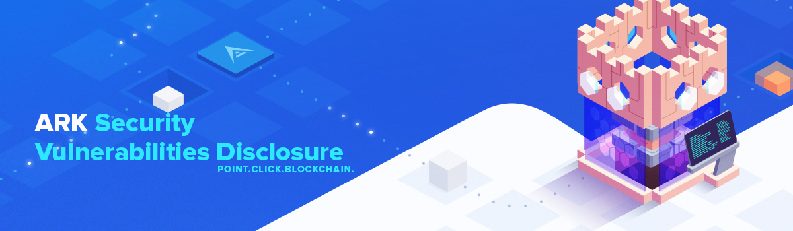

Producing software inherently comes with risks. All software, especially new releases and large code re-writes, have a higher probability of producing bugs during production and initial release. To combat this, the ARK team has introduced modern testing methods, higher test coverage, a custom developed e2e testing framework and increased the availability for testing on our Development Network prior to the releases. Despite all of that, no one can catch every potential issue. 

We are running our own [development and security bounty program](https://blog.ark.io/ark-development-and-security-bounty-program-a95122d06879). Please check detailed instructions on how to report a security vulnerability at https://ark.io/sv/.

>This repository series will serve as a public disclosure of any discovered and patched vulnerabilities within the ARK Blockchain Platform Product Landscape (Core, Desktop Wallet, Mobile Wallet, ARK Pay & Deployer).

The list of known and closed or still open security vulnerabilites can be found in the tables below. Each table consists of four fields, describing the basic information about the listed security vulnerabilities and a more detailed description is available by clicking on the link in the identifier field.

## Core Security Vulnerabilities

| Identifier | Title| Status | Version |
| ------------- | ------------ | ------ | ----- | 
| [Core-SV-072](/core/core-sv-072.md)| Slow query stopped nodes when requesting blocks from specific generators | Closed | [v2.7.13](https://github.com/ArkEcosystem/core/releases/tag/2.7.13) |
| [Core-SV-071](/core/core-sv-071.md)| Reviver function in the transport codec could cause denial of service | Closed | [v2.7.13](https://github.com/ArkEcosystem/core/releases/tag/2.7.13) |
| [Core-SV-070](/core/core-sv-070.md)| Incoming connections were not banned when failing basic validation checks | Closed | [v2.7.13](https://github.com/ArkEcosystem/core/releases/tag/2.7.13) |
| [Core-SV-069](/core/core-sv-069.md)| Exceeding individual but not global rate limit evaded ban | Closed | [v2.7.13](https://github.com/ArkEcosystem/core/releases/tag/2.7.13) |
| [Core-SV-068](/core/core-sv-068.md)| Automatic peer reconnection did not reattach socket event listeners | Closed | [v2.7.13](https://github.com/ArkEcosystem/core/releases/tag/2.7.13) |
| [Core-SV-067](/core/core-sv-067.md)| Schema violation requesting common blocks did not close the connection | Closed | [v2.7.13](https://github.com/ArkEcosystem/core/releases/tag/2.7.13) |
| [Core-SV-066](/core/core-sv-066.md)| Blocks were accepted but not propagated if received out of slot | Closed | [v2.7.13](https://github.com/ArkEcosystem/core/releases/tag/2.7.13) |
| [Core-SV-065](/core/core-sv-065.md)| Requesting blocks at a very high height locked up PostgreSQL | Closed | [v2.7.6](https://github.com/ArkEcosystem/core/releases/tag/2.7.6) |
| [Core-SV-064](/core/core-sv-064.md)| Binary data payloads could stop forging | Closed | [v2.7.6](https://github.com/ArkEcosystem/core/releases/tag/2.7.6) |
| [Core-SV-063](/core/core-sv-063.md)| Large payloads sent to internal endpoints prevented forging | Closed | [v2.7.6](https://github.com/ArkEcosystem/core/releases/tag/2.7.6) |
| [Core-SV-062](/core/core-sv-062.md)| Outgoing connections were not destroyed after receiving unsupported WebSocket frames | Closed | [v2.7.1](https://github.com/ArkEcosystem/core/releases/tag/2.7.1) |
| [Core-SV-061](/core/core-sv-061.md)| Peer lists could exceed the maximum permitted payload size | Closed | [v2.7.0](https://github.com/ArkEcosystem/core/releases/tag/2.7.0) |
| [Core-SV-060](/core/core-sv-060.md)| Outgoing sockets were not properly rate limited | Closed | [v2.7.0](https://github.com/ArkEcosystem/core/releases/tag/2.7.0) |
| [Core-SV-059](/core/core-sv-059.md)| Newly connected peers did not have an initial maximum payload limit | Closed | [v2.6.57](https://github.com/ArkEcosystem/core/releases/tag/2.6.57) |
| [Core-SV-058](/core/core-sv-058.md)| Insufficient transaction asset validation | Closed | [v2.6.57](https://github.com/ArkEcosystem/core/releases/tag/2.6.57) |
| [Core-SV-057](/core/core-sv-057.md)| HTTP header manipulation caused out of memory crashes | Closed | [v2.6.54](https://github.com/ArkEcosystem/core/releases/tag/2.6.54) |
| [Core-SV-056](/core/core-sv-056.md)| Prepending zeros in the hex representation of a signature would change its ID | Closed | [v2.6.52](https://github.com/ArkEcosystem/core/releases/tag/2.6.52) |
| [Core-SV-055](/core/core-sv-055.md)| Negative values were erroneously accepted in ECDSA signatures | Closed | [v2.6.49](https://github.com/ArkEcosystem/core/releases/tag/2.6.49) |
| [Core-SV-054](/core/core-sv-054.md)| DER signature manipulation could fork the network, roll back and replay transactions | Closed | [v2.6.49](https://github.com/ArkEcosystem/core/releases/tag/2.6.49) |
| [Core-SV-053](/core/core-sv-053.md)| Pool poisoning could stop delegates forging any transactions | Closed | [v2.6.49](https://github.com/ArkEcosystem/core/releases/tag/2.6.49) |
| [Core-SV-052](/core/core-sv-052.md)| Port ping payload sizes were unchecked and could cause bandwidth flood attacks | Closed | [v2.6.49](https://github.com/ArkEcosystem/core/releases/tag/2.6.49) |
| [Core-SV-051](/core/core-sv-051.md)| Slow PostgreSQL query attack could have caused delegates to miss blocks | Closed | [v2.6.49](https://github.com/ArkEcosystem/core/releases/tag/2.6.49) |
| [Core-SV-050](/core/core-sv-050.md)| Consecutive big blocks could exceed the maximum payload limit | Closed | [v2.6.49](https://github.com/ArkEcosystem/core/releases/tag/2.6.49) |
| [Core-SV-049](/core/core-sv-049.md)| ECDSA-signed block and transaction signatures were malleable | Closed | [v2.6.39](https://github.com/ArkEcosystem/core/releases/tag/2.6.39) |
| [Core-SV-048](/core/core-sv-048.md)| Delayed completion of peer verification stopped nodes forging | Closed | [v2.6.39](https://github.com/ArkEcosystem/core/releases/tag/2.6.39) |
| [Core-SV-047](/core/core-sv-047.md)| Block ID-based exceptions were vulnerable to preimage attacks and blockchain poisoning | Closed | [v2.6.39](https://github.com/ArkEcosystem/core/releases/tag/2.6.39) |
| [Core-SV-046](/core/core-sv-046.md)| Block schema violations could halt the blockchain | Closed | [v2.6.39](https://github.com/ArkEcosystem/core/releases/tag/2.6.39) |
| [Core-SV-045](/core/core-sv-045.md)| Induced slow block propagation forked the network | Closed | [v2.6.38](https://github.com/ArkEcosystem/core/releases/tag/2.6.38) |
| [Core-SV-044](/core/core-sv-044.md)| Marshalled block payloads using the peer-to-peer transport codec were not sanitized | Closed | [v2.6.37](https://github.com/ArkEcosystem/core/releases/tag/2.6.37) |
| [Core-SV-043](/core/core-sv-043.md)| Tree memory structure exceeded maximum call stack size when fetching unconfirmed transactions to forge | Closed | [v2.6.36](https://github.com/ArkEcosystem/core/releases/tag/2.6.36) |
| [Core-SV-042](/core/core-sv-042.md)| Nonce comparison took too long to complete when fetching unconfirmed transactions to forge | Closed | [v2.6.34](https://github.com/ArkEcosystem/core/releases/tag/2.6.34) |
| [Core-SV-041](/core/core-sv-041.md)| Overloading the public API could stop the transaction and block processing on a node | Closed | [v2.6.30](https://github.com/ArkEcosystem/core/releases/tag/2.6.30) |
| [Core-SV-040](/core/core-sv-040.md)| Long-lived HTTP requests via the P2P layer could crash the node | Closed | [v2.6.27](https://github.com/ArkEcosystem/core/releases/tag/2.6.27) |
| [Core-SV-039](/core/core-sv-039.md)| Pool wallet manager could lock up funds by not updating multipayment balances | Closed | [v2.6.21](https://github.com/ArkEcosystem/core/releases/tag/2.6.21) |
| [Core-SV-038](/core/core-sv-038.md)| Plain HTTP connections to the p2p port could crash the node's operating system | Closed | [v2.6.11](https://github.com/ArkEcosystem/core/releases/tag/2.6.11) |
| [Core-SV-037](/core/core-sv-037.md)| A malicious block containing thousands of transactions could take down a node | Closed | [v2.5.36](https://github.com/ArkEcosystem/core/releases/tag/2.5.36) |
| [Core-SV-036](/core/core-sv-036.md)| Opening thousands of sockets caused high CPU/memory usage and full server crashes | Closed | [v2.5.36](https://github.com/ArkEcosystem/core/releases/tag/2.5.36) |
| [Core-SV-035](/core/core-sv-035.md)| Broadcasting invalid WebSocket opcodes caused significant network degradation and missed blocks | Closed | [v2.5.36](https://github.com/ArkEcosystem/core/releases/tag/2.5.36) |
| [Core-SV-034](/core/core-sv-034.md)| Unhandled unemitted events could trigger high CPU spikes and propagation delays | Closed | [v2.5.36](https://github.com/ArkEcosystem/core/releases/tag/2.5.36) |
| [Core-SV-033](/core/core-sv-033.md)| JSON payloads with too many key-value pairs were too CPU intensive to parse | Closed | [v2.5.36](https://github.com/ArkEcosystem/core/releases/tag/2.5.36) |
| [Core-SV-032](/core/core-sv-032.md)| Multiple disconnect JSON packets caused high CPU utilization | Closed | [v2.5.31](https://github.com/ArkEcosystem/core/releases/tag/2.5.31) |
| [Core-SV-031](/core/core-sv-031.md)| Sending HyBi WebSocket headers with no data could stop nodes forging | Closed | [v2.5.30](https://github.com/ArkEcosystem/core/releases/tag/2.5.30) |
| [Core-SV-030](/core/core-sv-030.md)| Ping control frame bombardment could prevent block propagation | Closed | [v2.5.28](https://github.com/ArkEcosystem/core/releases/tag/2.5.28) |
| [Core-SV-029](/core/core-sv-029.md)| Externally hitting internal P2P endpoints could stop a node handling requests | Closed | [v2.5.25](https://github.com/ArkEcosystem/core/releases/tag/2.5.25) |
| [Core-SV-028](/core/core-sv-028.md)| Rate limiting was ineffective due to inappropriate disconnection methods | Closed | [v2.5.24](https://github.com/ArkEcosystem/core/releases/tag/2.5.24) |
| [Core-SV-027](/core/core-sv-027.md)| Malformed messages on the P2P layer could hang up a node and stop delegates forging | Closed | [v2.5.24](https://github.com/ArkEcosystem/core/releases/tag/2.5.24) |
| [Core-SV-026](/core/core-sv-026.md)| P2P endpoint request events were not sanitised | Closed | [v2.5.19](https://github.com/ArkEcosystem/core/releases/tag/2.5.19) |
| [Core-SV-025](/core/core-sv-025.md)| Core plugin names were not length restricted so could cause DoS in peer lists | Closed | [v2.5.19](https://github.com/ArkEcosystem/core/releases/tag/2.5.19) |
| [Core-SV-024](/core/core-sv-024.md)| Peer lists could become too large and be manipulated to become a DDoS network | Closed | [v2.5.14](https://github.com/ArkEcosystem/core/releases/tag/2.5.14) |
| [Core-SV-023](/core/core-sv-023.md)| Peer-to-peer postTransactions endpoint could be spammed to overwhelm nodes | Closed | [v2.5.14](https://github.com/ArkEcosystem/core/releases/tag/2.5.14) |
| [Core-SV-022](/core/core-sv-022.md)| Delegates can be forced to forge empty blocks and genuine transactions can be evicted from the pool | Closed | [v2.4.14](https://github.com/ArkEcosystem/core/releases/tag/2.4.14) |
| [Core-SV-021](/core/core-sv-021.md)| Unverified transactions in bad blocks can purge genuine transactions from the pool | Closed | [v2.4.13](https://github.com/ArkEcosystem/core/releases/tag/2.4.13) |
| [Core-SV-020](/core/core-sv-020.md)| Race condition can result in blocks containing already forged transactions | Closed | [v2.4](https://github.com/ArkEcosystem/core/releases/tag/2.4.0) |
| [Core-SV-019](/core/core-sv-019.md)| Block header manipulation in quorum calculations prevents nodes forging | Closed | [v2.4](https://github.com/ArkEcosystem/core/releases/tag/2.4.0) |
| [Core-SV-018](/core/core-sv-018.md)| Second Signature Transaction Pool Validation | Closed | [v2.4](https://github.com/ArkEcosystem/core/releases/tag/2.4.0) |
| [Core-SV-017](/core/core-sv-017.md)| Second Signature Transaction Broadcast/Sign/Order | Closed | [v2.3](https://github.com/ArkEcosystem/core/releases/tag/2.3.0) |k
| [Core-SV-016](/core/core-sv-016.md)| Receiving a block containing non-valid transactions causes peers to rollback | Closed | [v2.3](https://github.com/ArkEcosystem/core/releases/tag/2.3.0) |
| [Core-SV-015](/core/core-sv-015.md)| Delayed block propagation causes the next delegate to miss its block | Closed | [v2.3](https://github.com/ArkEcosystem/core/releases/tag/2.3.0) |
| [Core-SV-014](/core/core-sv-014.md)| API endpoint open to possible DDOS attack | Closed | [v2.2.2](https://github.com/ArkEcosystem/core/releases/tag/2.2.2) |
| [Core-SV-013](/core/core-sv-013.md)| Transactions near the payload size limit can stop delegates forging | Closed | [v2.1.2](https://github.com/ArkEcosystem/core/releases/tag/2.1.2) |
| [Core-SV-012](/core/core-sv-012.md)| Conflicting delegate registration transactions | Closed | [v2.1.0](https://github.com/ArkEcosystem/core/releases/tag/2.1.0) |
| [Core-SV-011](/core/core-sv-011.md)| Malicious delegate zero(0) - ARK transaction spam | Closed | [v2.0.18](https://github.com/ArkEcosystem/core/releases/tag/2.0.18) |
| [Core-SV-010](/core/core-sv-010.md)| Malicious delegate can cause peers to fork and roll back simultaneously | Closed | [v2.0.19](https://github.com/ArkEcosystem/core/releases/tag/2.0.19) |
| [Core-SV-009](/core/core-sv-009.md)| Fake peers can be added by using non-quad-dotted notation | Closed | [v2.0.19](https://github.com/ArkEcosystem/core/releases/tag/2.0.19) |
| [Core-SV-008](/core/core-sv-008.md)| Forged blocks by anyone can cause the chain to stop/or start recovering | Closed | [v2.0.17](https://github.com/ArkEcosystem/core/releases/tag/2.0.17) |
| [Core-SV-007](/core/core-sv-007.md)| Forging multiple blocks in a slot and rewards hijacking | Closed | [v2.0.17](https://github.com/ArkEcosystem/core/releases/tag/2.0.17) |
| [Core-SV-006](/core/core-sv-006.md)| Transaction replay attack with known 2nd signature passphrase / multisignature | Closed | [v2.6.0](https://github.com/ArkEcosystem/core/releases/tag/2.6.0) |
| [Core-SV-005](/core/core-sv-005.md)| Double forging a block | Open |  |
| [Core-SV-004](/core/core-sv-004.md)| IP spoofing | Closed | [v2.0.16](https://github.com/ArkEcosystem/core/releases/tag/2.0.16) |
| [Core-SV-003](/core/core-sv-003.md)| Second signature transaction replay  | Closed | [v2.0.16](https://github.com/ArkEcosystem/core/releases/tag/2.0.16) |
| [Core-SV-002](/core/core-sv-002.md)| Generating new Ark using multi signature transaction  | Closed | [v2.0.16](https://github.com/ArkEcosystem/core/releases/tag/2.0.16) |
| [Core-SV-001](/core/core-sv-001.md)| Invalid block received | Closed | [v2.0.16](https://github.com/ArkEcosystem/core/releases/tag/2.0.16) |

## Desktop Wallet Security Vulnerabilities

| Identifier| Title| Status | Version |
| ------------- | ------------ | ------ | ----- | 

## Mobile Wallet Security Vulnerabilities

| Identifier| Title| Status | Version |
| ------------- | ------------ | ------ | ----- | 

## Ark Pay Security Vulnerabilities

| Identifier| Title| Status | Version |
| ------------- | ------------ | ------ | ----- | 

## Ark Deployer Security Vulnerabilities

| Identifier| Title| Status | Version |
| ------------- | ------------ | ------ | ----- | 
